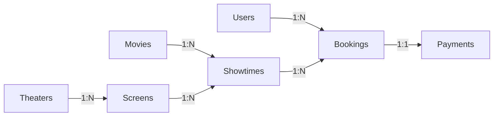

# 🎯 TÓM TẮT HOÀN THÀNH - Cinema Flutter App

## ✅ Đã hoàn thành 100%

### 📦 Các file đã tạo/cập nhật

#### 1. Models (7 files)
| File | Trạng thái | Mô tả |
|------|-----------|-------|
| `movie.dart` | ✅ Đã có sẵn | Model phim |
| `theater_model.dart` | ✅ Đã có sẵn | Model rạp chiếu |
| `screen_model.dart` | ✅ Đã có sẵn | Model phòng chiếu |
| `user_model.dart` | ✅ Đã có sẵn | Model người dùng |
| `showtime.dart` | 🔄 Đã cập nhật | Model lịch chiếu (từ simple → full) |
| `booking_model.dart` | ➕ Mới tạo | Model đặt vé |
| `payment_model.dart` | ➕ Mới tạo | Model thanh toán |
| `ticket.dart` | 🔄 Đã cập nhật | UI Model cho vé |

#### 2. Services (2 files)
| File | Trạng thái | Mô tả |
|------|-----------|-------|
| `firestore_service.dart` | 🔄 Mở rộng | CRUD đầy đủ cho 7 collections |
| `seed_data_service.dart` | ➕ Mới tạo | Service thêm dữ liệu mẫu |

#### 3. Screens (1 file)
| File | Trạng thái | Mô tả |
|------|-----------|-------|
| `screens/admin/seed_data_screen.dart` | ➕ Mới tạo | UI Admin seed data |
| `screens/examples/booking_example.dart` | ➕ Mới tạo | Code mẫu tham khảo |

#### 4. Documentation (4 files)
| File | Mô tả |
|------|-------|
| `ARCHITECTURE.md` | Kiến trúc tổng quan, relationships, security rules |
| `USAGE_GUIDE.md` | Hướng dẫn chi tiết, code examples |
| `IMPLEMENTATION_SUMMARY.md` | Tóm tắt triển khai, quick start |
| `THIS_FILE.md` | Tóm tắt nhanh những gì đã làm |

---

## 🎬 COLLECTIONS TRONG FIRESTORE

```
📊 7 Collections được thiết kế đầy đủ:

1. movies          → 5 phim mẫu (sau khi seed)
2. theaters        → 4 rạp (Hà Nội, HCM, Đà Nẵng)
3. screens         → 12 phòng chiếu (3/rạp)
4. showtimes       → 60+ lịch chiếu (7 ngày)
5. bookings        → Dynamic (user tạo)
6. payments        → Dynamic (user tạo)
7. users           → Dynamic (Firebase Auth)
```

---

## 🔗 MỐI QUAN HỆ DỮ LIỆU



---

## 🚀 CÁCH SỬ DỤNG NGAY

### Bước 1: Thêm import vào file main
```dart
// lib/main.dart
import 'screens/admin/seed_data_screen.dart';
```

### Bước 2: Thêm nút seed data vào home
```dart
// Trong HomeScreen hoặc Drawer
FloatingActionButton(
  onPressed: () {
    Navigator.push(
      context,
      MaterialPageRoute(builder: (_) => const SeedDataScreen()),
    );
  },
  child: const Icon(Icons.admin_panel_settings),
)
```

### Bước 3: Run app và seed
```bash
flutter run
# Nhấn nút Admin → Thêm dữ liệu
```

### Bước 4: Sử dụng FirestoreService
```dart
final _firestore = FirestoreService();

// Lấy phim
StreamBuilder<List<Movie>>(
  stream: _firestore.getMoviesStream(),
  builder: (context, snapshot) {
    // Your UI here
  },
)

// Tạo booking
final bookingId = await _firestore.createBooking(booking);

// Lấy booking của user
StreamBuilder<List<Booking>>(
  stream: _firestore.getBookingsByUser(userId),
  builder: (context, snapshot) {
    // Your UI here
  },
)
```

---

## 📖 ĐỌC THÊM

### Để hiểu kiến trúc:
→ Đọc `ARCHITECTURE.md`

### Để xem code examples:
→ Đọc `USAGE_GUIDE.md`
→ Xem `lib/screens/examples/booking_example.dart`

### Để bắt đầu nhanh:
→ Đọc `IMPLEMENTATION_SUMMARY.md`

---

## 🎯 TÍNH NĂNG ĐÃ TRIỂN KHAI

### ✅ Movies
- [x] CRUD đầy đủ
- [x] Filter theo status (now_showing/coming_soon)
- [x] Real-time updates

### ✅ Theaters & Screens
- [x] CRUD đầy đủ
- [x] Quan hệ theater-screens
- [x] Sơ đồ ghế chi tiết

### ✅ Showtimes
- [x] CRUD đầy đủ
- [x] Query theo movie/theater/date
- [x] Track ghế đã đặt
- [x] Real-time availability

### ✅ Bookings
- [x] Create với transaction (atomic)
- [x] Kiểm tra ghế trùng
- [x] Cancel booking (hoàn ghế)
- [x] Query theo user

### ✅ Payments
- [x] Create payment record
- [x] Link với booking
- [x] Update status
- [x] Support nhiều payment methods

### ✅ Users
- [x] Create user document
- [x] Favorite movies
- [x] Profile management

---

## 🔐 BẢO MẬT

Security Rules đầy đủ được cung cấp trong `ARCHITECTURE.md`:
- ✅ Public read cho movies/theaters/screens/showtimes
- ✅ User chỉ xem/sửa booking của mình
- ✅ User chỉ xem profile của mình

---

## 📊 INDEXES CẦN TẠO

Trong Firebase Console → Firestore → Indexes, tạo:

1. **showtimes**: `movieId + status + startTime`
2. **showtimes**: `theaterId + startTime + status`
3. **bookings**: `userId + createdAt`
4. **bookings**: `showtimeId + status`

---

## 💻 CODE QUALITY

### ✅ Best Practices đã áp dụng:
- [x] Models có `toMap()` và `fromFirestore()`
- [x] Models có `copyWith()` (immutable)
- [x] Service layer tách biệt
- [x] Transaction cho atomic operations
- [x] Error handling
- [x] Real-time streams
- [x] Type safety

### ✅ Documentation:
- [x] Comments đầy đủ trong code
- [x] 4 file markdown hướng dẫn
- [x] Code examples chi tiết

---

## 🎉 KẾT QUẢ

Bạn có một **Cinema Booking App** với:

✅ **Backend**: Firestore với 7 collections  
✅ **Models**: 7+ Dart models hoàn chỉnh  
✅ **Services**: CRUD đầy đủ cho tất cả entities  
✅ **Seed Data**: Tool tự động thêm dữ liệu mẫu  
✅ **Admin UI**: Màn hình quản lý data  
✅ **Examples**: Code mẫu để tham khảo  
✅ **Docs**: Hướng dẫn chi tiết từ A-Z  

---

## 🔜 TIẾP THEO LÀM GÌ?

### Phase 2: Kết nối UI
1. Cập nhật các màn hình hiện có để dùng `FirestoreService`
2. Implement booking flow đầy đủ
3. Implement payment flow
4. Test end-to-end

### Phase 3: Enhancement
1. Add search & filter
2. Add notifications
3. Add reviews & ratings
4. Add promotions

---

## 📞 GẶP VẤN ĐỀ?

### Lỗi Firebase not initialized?
```dart
// main.dart
await Firebase.initializeApp(
  options: DefaultFirebaseOptions.currentPlatform,
);
```

### Lỗi permission denied?
→ Update Security Rules (xem ARCHITECTURE.md)

### Lỗi index required?
→ Click link trong error để tạo index tự động

### Code không chạy?
```bash
flutter clean
flutter pub get
flutter run
```

---

## 📄 TÓM TẮT FILES

```
📦 cinema_flutter_app/
├── lib/
│   ├── models/              → 7 models ✅
│   ├── services/            → 2 services ✅
│   └── screens/
│       ├── admin/           → 1 admin screen ✅
│       └── examples/        → 1 example file ✅
│
└── 📖 Documentation/
    ├── ARCHITECTURE.md           → Kiến trúc ✅
    ├── USAGE_GUIDE.md            → Hướng dẫn ✅
    ├── IMPLEMENTATION_SUMMARY.md → Quick start ✅
    └── SUMMARY.md                → File này ✅
```

---

## 🎓 HỌC TỪ PROJECT NÀY

### Về Firebase Firestore:
- ✅ Cách thiết kế collections
- ✅ Cách dùng transactions
- ✅ Cách query phức tạp
- ✅ Real-time listeners
- ✅ Security rules

### Về Flutter:
- ✅ Model design patterns
- ✅ Service layer architecture
- ✅ StreamBuilder usage
- ✅ Error handling
- ✅ State management basics

---

**🎉 Chúc bạn thành công với project Cinema App!**

Made with ❤️ by AI Assistant
